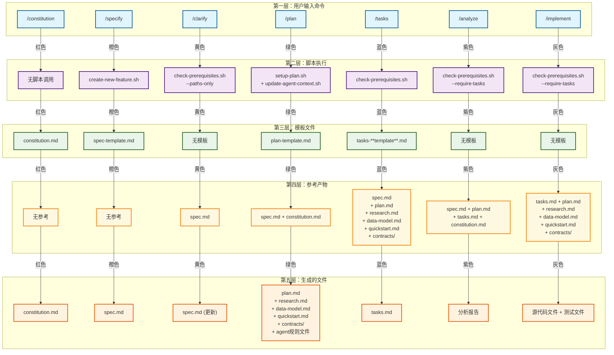

# SpecKit 命令原理

## 概述

本文档深入解析当用户在 AI Agent 中触发命令（如 `/specify`, `/plan`, `/tasks` 等）后，SpecKit 系统内部的完整业务流程，包括脚本如何执行、模板如何使用、文档如何生成和更新，以及从用户命令到文档生成的完整技术实现。

## SpecKit 命令总流程图

> **📖 如何使用这个流程图**：
> - **颜色编码**：每个命令用不同颜色线条连接，便于追踪完整流程
> - **层次结构**：从上到下展示从用户输入到文件生成的完整过程
> - **快速导航**：点击下方命令名称可跳转到详细说明
> - **使用顺序**：按照 constitution → specify → clarify → plan → tasks → analyze → implement 的顺序执行  



## 命令详细原理分析

### 1. `/constitution` 命令原理

#### 背后流程
当用户在 AI Agent 中触发 `/constitution` 命令时：

1. **无脚本调用**：该命令不调用任何外部脚本，完全由 AI Agent 内部处理
2. **模板加载**：AI Agent 从 `memory/constitution.md` 模板文件加载内容
3. **内容生成**：AI Agent 根据用户输入生成项目治理原则和开发指导方针
4. **文件创建**：直接在 `memory/constitution.md` 创建或更新文件

#### 文档组织
- **输入**：用户描述的项目原则和治理要求
- **模板**：`memory/constitution.md` 模板文件
- **输出**：`memory/constitution.md` 项目宪法文件
- **参考**：无其他文档依赖

#### 技术实现
- **无脚本执行**：完全依赖 AI Agent 的模板处理能力
- **模板系统**：使用预定义的宪法模板结构
- **内容填充**：AI Agent 根据用户输入填充模板占位符
- **版本控制**：自动生成版本号、批准日期等元数据

#### 模板执行流程
根据 `memory/constitution.md` 模板，AI Agent 执行以下流程：

1. **解析用户输入**：分析用户描述的项目原则和治理要求
2. **填充核心原则**：根据输入生成 5 个核心原则（Library-First、CLI Interface、Test-First 等）
3. **添加约束条件**：生成技术栈要求、合规标准、部署策略等
4. **设置工作流程**：定义代码审查要求、测试门禁、部署审批流程
5. **生成治理规则**：创建宪法优先规则、修订流程、合规检查机制
6. **元数据生成**：自动设置版本号、批准日期、最后修订日期

### 2. `/specify` 命令原理

#### 背后流程
当用户触发 `/specify` 命令时：

1. **脚本调用**：执行 `create-new-feature.sh` 脚本
2. **分支创建**：自动创建新的功能分支（如 `001-feature-name`）
3. **目录结构**：在 `specs/001-feature-name/` 创建功能目录
4. **模板复制**：将 `spec-template.md` 复制到 `spec.md`
5. **环境变量**：设置 `SPECIFY_FEATURE` 环境变量

#### 文档组织
- **输入**：用户的功能描述和需求
- **模板**：`templates/spec-template.md` 规格模板
- **输出**：`specs/[feature-name]/spec.md` 功能规格文档
- **参考**：无其他文档依赖

#### 技术实现
```bash
# create-new-feature.sh 核心逻辑
1. 解析功能描述
2. 生成下一个功能编号（001, 002, 003...）
3. 创建功能分支（如果使用 Git）
4. 创建功能目录结构
5. 复制规格模板
6. 设置环境变量
```

#### 模板执行流程
根据 `templates/spec-template.md` 模板，AI Agent 执行以下流程：

1. **解析用户描述**：从用户输入中提取功能描述
2. **提取关键概念**：识别参与者、动作、数据、约束条件
3. **标记模糊需求**：对不清楚的方面使用 `[NEEDS CLARIFICATION: 具体问题]`
4. **填充用户场景**：生成主要用户故事和验收场景
5. **生成功能需求**：创建可测试的功能需求列表
6. **识别关键实体**：如果涉及数据，识别主要实体
7. **运行审查清单**：检查规格完整性和质量
8. **更新执行状态**：标记各个处理步骤的完成状态

### 3. `/clarify` 命令原理

#### 背后流程
当用户触发 `/clarify` 命令时：

1. **脚本调用**：执行 `check-prerequisites.sh --paths-only`
2. **路径验证**：检查当前功能目录和文件路径
3. **规格分析**：AI Agent 分析 `spec.md` 中的模糊需求
4. **问题生成**：生成结构化的澄清问题
5. **规格更新**：将澄清结果更新到 `spec.md`

#### 文档组织
- **输入**：现有的 `spec.md` 文件
- **模板**：无特定模板，使用 AI Agent 的澄清逻辑
- **输出**：更新后的 `spec.md` 文件
- **参考**：`spec.md` 文件内容

#### 技术实现
```bash
# check-prerequisites.sh --paths-only 输出
{
  "REPO_ROOT": "/path/to/repo",
  "BRANCH": "001-feature-name", 
  "FEATURE_DIR": "/path/to/specs/001-feature-name",
  "FEATURE_SPEC": "/path/to/spec.md",
  "IMPL_PLAN": "/path/to/plan.md",
  "TASKS": "/path/to/tasks.md"
}
```

#### 模板执行流程
`/clarify` 命令没有特定模板，AI Agent 执行以下澄清流程：

1. **分析现有规格**：读取 `spec.md` 文件内容
2. **识别模糊点**：查找 `[NEEDS CLARIFICATION]` 标记
3. **生成澄清问题**：为每个模糊点生成具体的澄清问题
4. **结构化提问**：按优先级和逻辑顺序组织问题
5. **记录澄清结果**：将用户回答整合到规格中
6. **更新规格文档**：移除 `[NEEDS CLARIFICATION]` 标记，添加澄清内容
7. **验证完整性**：确保所有模糊点都已澄清

### 4. `/plan` 命令原理

#### 背后流程
当用户触发 `/plan` 命令时：

1. **脚本调用**：执行 `setup-plan.sh` 脚本
2. **模板复制**：将 `plan-template.md` 复制到 `plan.md`
3. **上下文更新**：执行 `update-agent-context.sh` 更新 AI Agent 上下文
4. **规格分析**：AI Agent 分析 `spec.md` 和 `constitution.md`
5. **技术规划**：生成技术栈选择和架构设计
6. **文档生成**：创建 `research.md`、`data-model.md`、`quickstart.md`、`contracts/` 等

#### 文档组织
- **输入**：`spec.md` + `constitution.md`
- **模板**：`templates/plan-template.md` 计划模板
- **输出**：`plan.md` + `research.md` + `data-model.md` + `quickstart.md` + `contracts/`
- **参考**：规格文档和宪法文档

#### 技术实现
```bash
# setup-plan.sh 核心逻辑
1. 验证功能分支
2. 复制计划模板到 plan.md
3. 输出路径信息给 AI Agent

# update-agent-context.sh 核心逻辑  
1. 解析 plan.md 中的技术信息
2. 更新 AI Agent 上下文文件（如 CLAUDE.md）
3. 添加新技术栈和最近变更
```

#### 模板执行流程
根据 `templates/plan-template.md` 模板，AI Agent 执行以下流程：

1. **加载功能规格**：从 `spec.md` 读取功能需求
2. **填充技术上下文**：扫描并解决 `NEEDS CLARIFICATION` 标记
3. **检测项目类型**：根据上下文确定项目类型（web/mobile/single）
4. **宪法检查**：基于宪法文档内容填充宪法检查部分
5. **评估宪法合规**：检查是否存在违反宪法的设计，记录复杂性跟踪
6. **执行阶段 0**：生成 `research.md` 研究文档
7. **执行阶段 1**：创建 `contracts/`、`data-model.md`、`quickstart.md`、Agent 上下文文件
8. **重新评估宪法**：检查设计后是否产生新的宪法违规
9. **规划阶段 2**：描述任务生成方法（不实际创建 tasks.md）
10. **停止准备**：为 `/tasks` 命令做好准备

### 5. `/tasks` 命令原理

#### 背后流程
当用户触发 `/tasks` 命令时：

1. **脚本调用**：执行 `check-prerequisites.sh` 验证前置条件
2. **计划分析**：AI Agent 分析 `plan.md` 和相关设计文档
3. **任务生成**：根据设计文档生成具体的实现任务
4. **依赖分析**：确定任务之间的依赖关系和并行执行标记
5. **模板填充**：使用 `tasks-template.md` 生成 `tasks.md`

#### 文档组织
- **输入**：`plan.md` + `research.md` + `data-model.md` + `contracts/`
- **模板**：`templates/tasks-template.md` 任务模板
- **输出**：`tasks.md` 任务列表文档
- **参考**：所有设计阶段的文档

#### 技术实现
```bash
# check-prerequisites.sh 验证逻辑
1. 检查 plan.md 是否存在
2. 验证功能目录结构
3. 输出可用文档列表
4. 确保所有前置条件满足
```

#### 模板执行流程
根据 `templates/tasks-template.md` 模板，AI Agent 执行以下流程：

1. **加载计划文档**：从 `plan.md` 读取技术栈和架构信息
2. **加载设计文档**：读取 `data-model.md`、`contracts/`、`research.md`
3. **按类别生成任务**：
   - 设置：项目初始化、依赖管理、代码规范
   - 测试：契约测试、集成测试
   - 核心：模型、服务、CLI 命令
   - 集成：数据库、中间件、日志
   - 完善：单元测试、性能、文档
4. **应用任务规则**：
   - 不同文件标记 `[P]` 并行执行
   - 相同文件顺序执行
   - 测试优先于实现（TDD）
5. **任务编号**：按顺序编号（T001, T002...）
6. **生成依赖图**：确定任务间依赖关系
7. **创建并行示例**：展示可并行执行的任务组合
8. **验证任务完整性**：确保所有契约、实体、端点都有对应任务

### 6. `/analyze` 命令原理

#### 背后流程
当用户触发 `/analyze` 命令时：

1. **脚本调用**：执行 `check-prerequisites.sh --require-tasks`
2. **文档验证**：确保 `tasks.md` 和所有设计文档存在
3. **一致性分析**：AI Agent 分析各文档间的一致性
4. **覆盖度检查**：验证需求覆盖度和实现完整性
5. **分析报告**：生成详细的分析报告

#### 文档组织
- **输入**：`spec.md` + `plan.md` + `tasks.md` + `constitution.md`
- **模板**：无特定模板，使用 AI Agent 分析逻辑
- **输出**：分析报告（文本形式）
- **参考**：所有已生成的文档

#### 技术实现
```bash
# check-prerequisites.sh --require-tasks 验证逻辑
1. 检查 plan.md 存在
2. 检查 tasks.md 存在（必需）
3. 验证所有设计文档完整性
4. 输出可用文档列表
```

#### 模板执行流程
`/analyze` 命令没有特定模板，AI Agent 执行以下分析流程：

1. **文档完整性检查**：验证所有必需文档存在且完整
2. **一致性分析**：
   - 规格与计划的一致性
   - 计划与任务的一致性
   - 任务与实现的一致性
3. **覆盖度检查**：
   - 功能需求覆盖度
   - 测试覆盖度
   - 实现覆盖度
4. **质量评估**：
   - 文档质量评估
   - 架构合理性评估
   - 可维护性评估
5. **风险识别**：
   - 技术风险识别
   - 依赖风险识别
   - 性能风险识别
6. **建议生成**：基于分析结果生成改进建议
7. **报告输出**：生成详细的分析报告

### 7. `/implement` 命令原理

#### 背后流程
当用户触发 `/implement` 命令时：

1. **脚本调用**：执行 `check-prerequisites.sh --require-tasks`
2. **任务验证**：确保所有前置条件满足
3. **任务执行**：AI Agent 按照 `tasks.md` 执行实现任务
4. **代码生成**：生成源代码文件和测试文件
5. **测试执行**：运行测试验证实现正确性

#### 文档组织
- **输入**：`tasks.md` + `plan.md` + `research.md` + `data-model.md` + `contracts/`
- **模板**：无特定模板，基于任务列表执行
- **输出**：源代码文件 + 测试文件
- **参考**：所有设计文档和任务列表

#### 技术实现
```bash
# check-prerequisites.sh --require-tasks 最终验证
1. 验证所有前置条件
2. 确保 tasks.md 存在且完整
3. 验证所有设计文档可用
4. 准备执行环境
```

#### 模板执行流程
`/implement` 命令没有特定模板，AI Agent 执行以下实现流程：

1. **任务解析**：读取 `tasks.md` 文件，解析所有任务
2. **依赖分析**：分析任务间依赖关系，确定执行顺序
3. **并行规划**：识别可并行执行的任务（标记 `[P]`）
4. **顺序执行**：
   - 按依赖顺序执行任务
   - 优先执行测试任务（TDD）
   - 然后执行实现任务
5. **代码生成**：
   - 根据任务描述生成源代码
   - 创建测试文件
   - 生成配置文件
6. **测试执行**：
   - 运行单元测试
   - 运行集成测试
   - 验证功能正确性
7. **质量检查**：
   - 代码规范检查
   - 性能测试
   - 安全检查
8. **文档更新**：更新相关文档和注释

## 核心设计原则

### 1. 模板驱动
- 每个命令都有对应的模板文件
- 模板定义了文档结构和内容要求
- AI Agent 根据模板生成标准化文档

### 2. 脚本自动化
- 每个命令都调用相应的脚本处理文件操作
- 脚本负责目录创建、文件复制、路径验证等
- 确保文件系统操作的一致性和可靠性

### 3. 依赖管理
- 命令之间有明确的依赖关系
- 前置条件检查确保命令执行的正确顺序
- 错误处理机制防止不完整的状态

### 4. 上下文维护
- AI Agent 上下文文件自动更新
- 技术栈信息持续累积
- 项目历史记录完整保存

### 5. 并行优化
- 任务标记 `[P]` 支持并行执行
- 依赖分析确保执行顺序正确
- 提高开发效率

## 总结

SpecKit 的命令系统通过精心设计的模板、脚本和文档组织，实现了从用户需求到代码实现的完整自动化流程。每个命令都有明确的职责和输出，通过依赖关系串联成完整的开发工作流。这种设计既保证了开发过程的结构化，又提供了足够的灵活性来适应不同的项目需求。