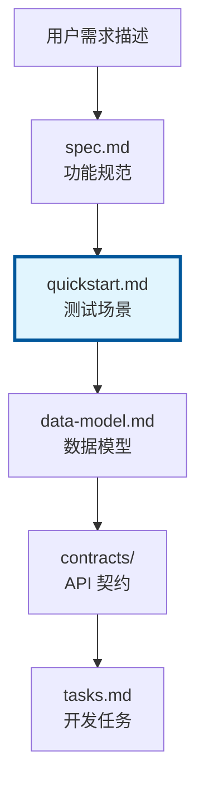
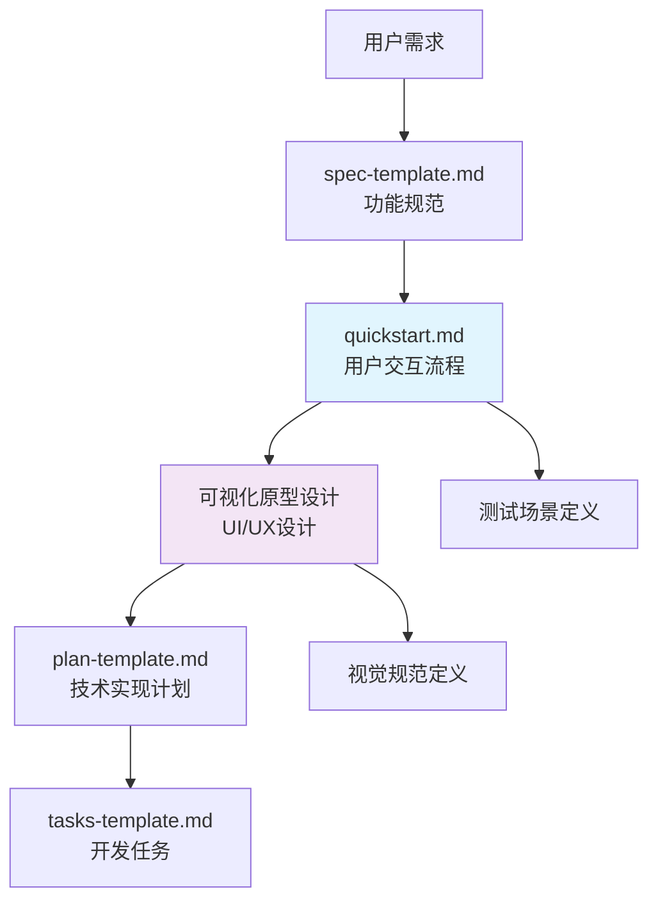
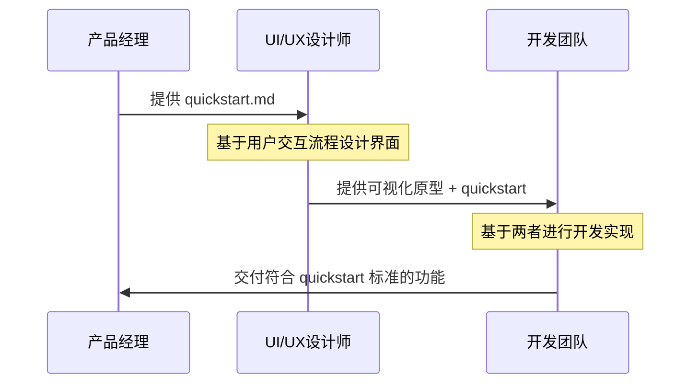
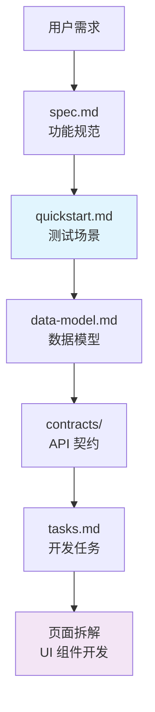

# Quickstart 学习指南

## 概述

本指南深入解析 spec-kit 中 quickstart 的作用、定位以及与其他开发流程的关系。通过详细分析 quickstart 在 spec-driven 开发工作流中的具体作用，帮助开发者正确理解和使用 quickstart 功能。

## 目录

- [Quickstart 的定义与定位](#quickstart-的定义与定位)
- [Quickstart 的核心作用](#quickstart-的核心作用)
- [Quickstart 与用户交互流程的关系](#quickstart-与用户交互流程的关系)
- [Quickstart 与页面设计的关系](#quickstart-与页面设计的关系)
- [Quickstart 与页面拆解的关系](#quickstart-与页面拆解的关系)
- [Quickstart 在工作流中的位置](#quickstart-在工作流中的位置)
- [实际应用示例](#实际应用示例)
- [最佳实践建议](#最佳实践建议)
- [常见误区](#常见误区)

## Quickstart 的定义与定位

### 什么是 Quickstart

在 spec-kit 工作流中，quickstart 有两个层面的含义：

#### 1. 用户指南层面的 quickstart
- **文件位置**: `/docs/quickstart.md`
- **内容**: 如何使用 spec-kit 的 4 步流程指南
- **目标用户**: 初次使用 spec-kit 的开发者

#### 2. 功能规范层面的 quickstart
- **文件位置**: `/specs/[feature]/quickstart.md`
- **生成阶段**: Phase 1 设计阶段输出
- **内容**: 用户故事和测试场景定义
- **目标用户**: 开发团队和测试人员

### Quickstart 的定位



**核心定位**：
- ✅ **测试场景定义文档**
- ✅ **用户故事验证标准**
- ✅ **功能验收基准**
- ❌ **不是可视化原型设计**
- ❌ **不是页面拆解文档**

## Quickstart 的核心作用

### 1. 测试场景验证 (Test Scenario Validation)

quickstart 是测试场景的重要来源：

```markdown
# 在 tasks-template.md 中的体现
- 第113行: "Quickstart scenarios → validation tasks"
- 第174行: "Quickstart test = story validation steps"
```

**作用**：
- 定义用户行为的测试用例
- 确保功能实现符合用户期望
- 提供验收测试的具体标准

### 2. 用户故事测试 (User Story Testing)

quickstart 包含从用户故事中提取的测试场景：

```markdown
# 示例：Taskify 项目的用户故事
"When you first launch Taskify, it's going to give you a list of the five users to pick from"
"When you click on a user, you go into the main view, which displays the list of projects"
"When you click on a project, you open the Kanban board for that project"
```

**作用**：
- 每个用户故事生成对应的集成测试任务
- 验证功能是否符合用户需求
- 作为测试驱动开发(TDD)的测试用例来源

### 3. Phase 1 设计阶段输出

quickstart 是 Phase 1 设计阶段的重要输出：

```markdown
# 在 plan-template.md 中的体现
├── quickstart.md        # Phase 1 output (/plan command)
```

**生成时机**：
- 在 `/plan` 命令执行时生成
- 基于功能规范中的用户故事
- 作为后续任务生成的重要输入

### 4. 任务生成的重要输入

quickstart 是生成开发任务的重要输入源：

```markdown
# 在 tasks-template.md 中的体现
- 第16行: "IF EXISTS: Read quickstart.md for test scenarios"
- 第191行: "Generate tasks from Phase 1 design docs (contracts, data model, quickstart)"
```

## Quickstart 与用户交互流程的关系

### 交互流程定义

quickstart 详细描述用户交互流程，但不涉及视觉设计：

```text
# 用户交互流程描述示例
✅ 定义用户操作序列: 点击 → 跳转 → 显示
✅ 描述交互逻辑: 拖拽、颜色区分、权限控制
✅ 明确功能边界: 什么能做，什么不能做
❌ 不涉及视觉设计: 颜色、布局、字体等
```

### 与可视化原型设计的关系

**quickstart 不能代替可视化原型设计**：

#### Quickstart 的局限性：
- **缺乏视觉信息**：没有布局、颜色、字体、图标等设计元素
- **缺乏空间关系**：不知道元素在页面上的具体位置
- **缺乏交互反馈**：没有动画、过渡效果等细节
- **缺乏品牌表达**：没有体现产品的视觉风格和品牌调性

#### 可视化原型设计的价值：
- **空间布局**：元素的位置、大小、层次关系
- **视觉层次**：重要信息的突出显示
- **交互细节**：按钮状态、悬停效果、加载动画
- **用户体验**：直观的界面流程和操作反馈

### 协作关系



**理想工作流程**：
1. **quickstart** → 定义用户交互逻辑和功能流程
2. **可视化原型** → 设计具体的界面布局和视觉表现
3. **技术实现** → 基于两者进行开发

## Quickstart 与页面设计的关系

### 页面设计定位

quickstart 在页面设计中的定位：

- **功能需求文档**：为设计师提供清晰的功能需求
- **验收标准**：确保原型设计不偏离用户需求
- **测试基准**：作为功能验收的标准

### 设计协作流程



## Quickstart 与页面拆解的关系

### 页面拆解不包含在 Quickstart 中

**明确结论**：quickstart 不包含页面拆解。

### 页面拆解的实际位置

从 `plan-template.md` 可以看出，页面拆解应该在：

```markdown
# Option 2: Web application (when "frontend" + "backend" detected)
frontend/
├── src/
│   ├── components/    # ← UI 组件在这里
│   ├── pages/         # ← 页面拆解在这里
│   └── services/
```

**页面拆解发生时机**：
- **Phase 1 设计阶段**：通过 `data-model.md` 和 `contracts/` 定义功能
- **Phase 2 任务生成**：通过 `tasks.md` 生成具体的组件开发任务
- **Phase 3 实现阶段**：实际开发 UI 组件和页面

### 页面拆解与 Quickstart 的关系



**关系说明**：
- quickstart 提供**测试验收标准**
- 页面拆解基于 quickstart 的测试场景进行
- quickstart 确保页面功能符合用户期望

## Quickstart 在工作流中的位置

### 完整工作流

```mermaid
graph TD
    A[用户需求描述] --> B[/specify 命令]
    B --> C[spec.md<br/>功能规范]
    C --> D[/plan 命令]
    D --> E[Phase 0: research.md]
    E --> F[Phase 1: 设计阶段]
    F --> G[data-model.md]
    F --> H[contracts/]
    F --> I[quickstart.md]
    F --> J[agent-specific 文件]
    I --> K[/tasks 命令]
    K --> L[tasks.md<br/>开发任务]
    L --> M[页面拆解<br/>UI 组件开发]
    
    style I fill:#e1f5fe
    style I stroke:#01579b
    style I stroke-width:3px
```

### 各阶段输出

| 阶段 | 命令 | 输出文件 | Quickstart 作用 |
|------|------|----------|----------------|
| Phase 0 | `/plan` | `research.md` | 无 |
| Phase 1 | `/plan` | `quickstart.md` | **生成测试场景** |
| Phase 2 | `/tasks` | `tasks.md` | **作为任务生成输入** |
| Phase 3+ | 实现 | 代码实现 | **作为验收标准** |

## 实际应用示例

### Taskify 项目示例

基于 quickstart 中的用户故事进行页面拆解：

```text
# Quickstart 中的用户故事
"When you first launch Taskify, it's going to give you a list of the five users to pick from"
"When you click on a user, you go into the main view, which displays the list of projects"
"When you click on a project, you open the Kanban board for that project"
"You'll be able to drag and drop cards back and forth between different columns"
```

**基于此生成的页面拆解**：
- 用户选择页面 (UserSelectionPage)
- 项目列表页面 (ProjectListPage)  
- 看板页面 (KanbanBoardPage)
- 任务卡片组件 (TaskCard)
- 评论组件 (CommentSection)

### 测试场景定义

```markdown
# quickstart.md 中的测试场景示例
## 用户选择测试
- Given: 用户访问应用首页
- When: 页面加载完成
- Then: 显示 5 个用户选择按钮

## 项目列表测试  
- Given: 用户已选择身份
- When: 点击进入主视图
- Then: 显示 3 个示例项目列表

## 看板操作测试
- Given: 用户进入项目看板
- When: 拖拽任务卡片到不同列
- Then: 任务状态更新，卡片颜色区分
```

## 最佳实践建议

### 1. Quickstart 编写原则

- **聚焦用户行为**：描述用户做什么，而不是系统如何实现
- **具体可测试**：每个场景都应该能够编写自动化测试
- **完整覆盖**：包含正常流程、异常流程和边界条件
- **避免技术细节**：不涉及具体的技术实现方案

### 2. 与设计团队的协作

- **提供清晰需求**：quickstart 为设计师提供明确的功能需求
- **保持沟通**：确保设计师理解用户交互流程
- **验收标准**：将 quickstart 作为设计验收的标准

### 3. 与开发团队的协作

- **测试驱动**：基于 quickstart 编写测试用例
- **功能验证**：确保实现符合 quickstart 中定义的场景
- **持续更新**：随着需求变化及时更新 quickstart

## 常见误区

### ❌ 误区 1：Quickstart 可以代替原型设计

**错误认知**：认为 quickstart 包含了足够的界面设计信息
**实际情况**：quickstart 只定义功能流程，不包含视觉设计
**正确做法**：quickstart + 可视化原型设计

### ❌ 误区 2：Quickstart 包含页面拆解

**错误认知**：认为 quickstart 会自动生成页面拆解
**实际情况**：页面拆解在 tasks.md 生成阶段进行
**正确做法**：基于 quickstart 的测试场景进行页面拆解

### ❌ 误区 3：Quickstart 是技术实现文档

**错误认知**：在 quickstart 中描述技术实现细节
**实际情况**：quickstart 专注于用户行为和业务需求
**正确做法**：技术细节在 plan.md 和 tasks.md 中描述

### ❌ 误区 4：Quickstart 可以跳过

**错误认知**：认为 quickstart 是可选的文档
**实际情况**：quickstart 是测试场景的重要来源
**正确做法**：每个功能都应该有对应的 quickstart

## 总结

Quickstart 在 spec-kit 工作流中扮演着**测试场景定义和用户故事验证**的关键角色：

### 核心价值
- ✅ **测试场景定义**：为功能测试提供具体标准
- ✅ **用户故事验证**：确保实现符合用户期望
- ✅ **验收基准**：作为功能验收的客观标准
- ✅ **任务生成输入**：为开发任务生成提供重要信息

### 定位边界
- ❌ **不是可视化原型设计**：缺乏视觉和空间信息
- ❌ **不是页面拆解文档**：不包含 UI 组件分析
- ❌ **不是技术实现文档**：专注于业务需求而非技术细节

### 最佳实践
- 与设计团队协作，提供清晰的功能需求
- 与开发团队协作，确保测试驱动开发
- 保持文档的及时更新和准确性
- 避免常见误区，正确理解 quickstart 的作用边界

通过正确理解和使用 quickstart，可以显著提高 spec-driven 开发的质量和效率，确保最终产品真正满足用户需求。

---

*本文档基于 spec-kit 项目分析整理，如有疑问请参考项目源码或相关文档。*
