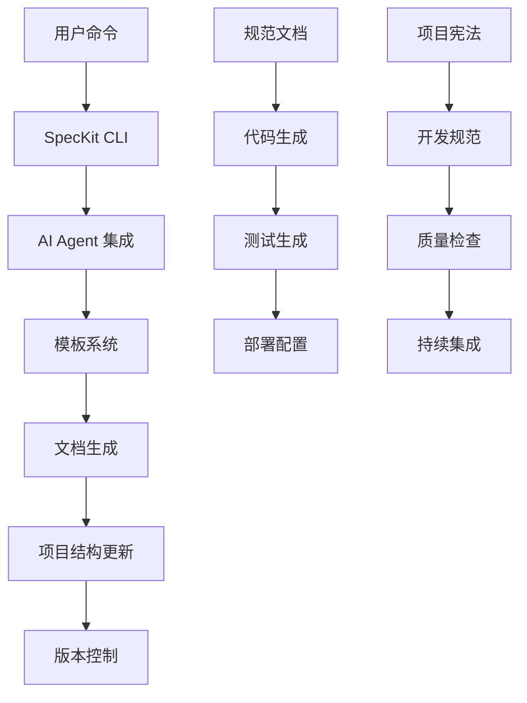
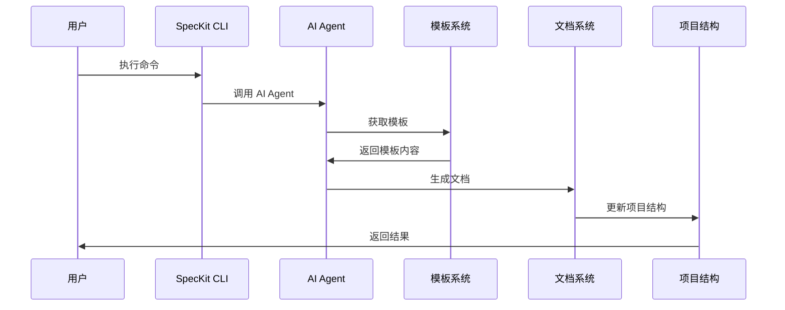
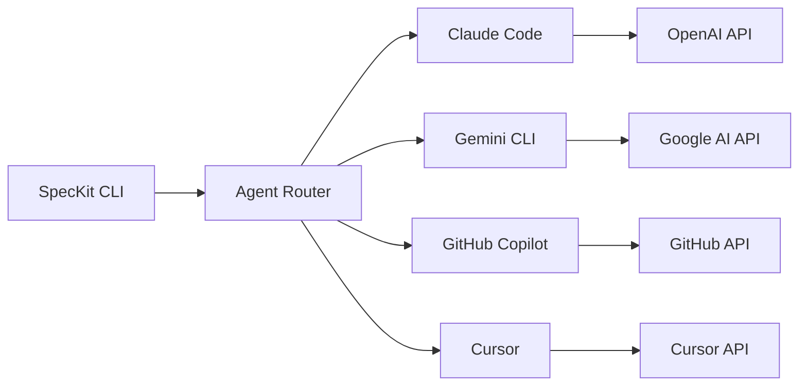
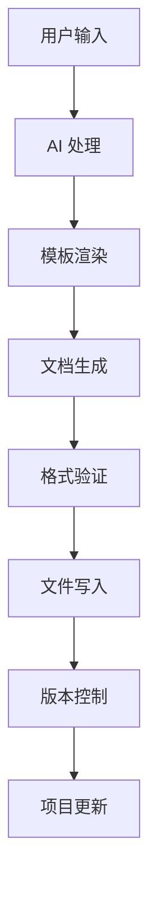
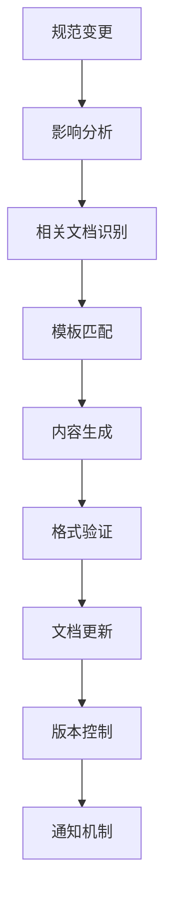

# SpecKit 命令原理

## 概述

本文档深入解析 SpecKit 命令背后的工作机制，包括用户触发命令后的完整流程、业务文档的组织和更新机制，以及从用户命令到文档生成的完整技术实现。

## 整体架构

### 系统组件关系图



### 核心工作流程



## 命令执行流程详解

### 1. 用户命令触发

#### 命令解析过程

```python
# 伪代码示例
def execute_command(command, args):
    # 1. 解析命令和参数
    parsed_command = parse_command(command)
    parsed_args = parse_arguments(args)
    
    # 2. 验证命令有效性
    validate_command(parsed_command)
    
    # 3. 检查项目环境
    check_project_environment()
    
    # 4. 执行命令逻辑
    return execute_command_logic(parsed_command, parsed_args)
```

#### 环境检查机制

- **项目结构验证**: 检查是否为有效的 SpecKit 项目
- **AI Agent 状态**: 验证 AI Agent 是否可用
- **依赖检查**: 确保所有必需的依赖都已安装
- **权限验证**: 检查文件系统权限

### 2. AI Agent 集成

#### 多 Agent 支持架构



#### Agent 调用机制

```python
# Agent 调用示例
class AgentRouter:
    def __init__(self):
        self.agents = {
            'claude': ClaudeAgent(),
            'gemini': GeminiAgent(),
            'copilot': CopilotAgent(),
            'cursor': CursorAgent()
        }
    
    def execute_command(self, agent_type, command, context):
        agent = self.agents.get(agent_type)
        if not agent:
            raise ValueError(f"Unsupported agent: {agent_type}")
        
        return agent.execute(command, context)
```

### 3. 模板系统

#### 模板组织结构

```
templates/
├── commands/              # 命令模板
│   ├── plan.md           # 计划模板
│   ├── specify.md        # 规范模板
│   ├── clarify.md        # 澄清模板
│   ├── tasks.md          # 任务模板
│   ├── implement.md      # 实现模板
│   ├── analyze.md        # 分析模板
│   └── constitution.md   # 宪法模板
├── plan-template.md      # 计划文档模板
├── spec-template.md      # 规范文档模板
└── tasks-template.md      # 任务文档模板
```

#### 模板渲染机制

```python
# 模板渲染示例
class TemplateRenderer:
    def render_template(self, template_name, context):
        # 1. 加载模板文件
        template = load_template(template_name)
        
        # 2. 准备上下文数据
        context_data = self.prepare_context(context)
        
        # 3. 渲染模板
        rendered_content = template.render(context_data)
        
        # 4. 后处理
        return self.post_process(rendered_content)
    
    def prepare_context(self, context):
        return {
            'project_name': context.get('project_name'),
            'ai_agent': context.get('ai_agent'),
            'timestamp': datetime.now(),
            'user_input': context.get('user_input'),
            'existing_docs': context.get('existing_docs', {})
        }
```

### 4. 文档生成和更新

#### 文档生成流程



#### 文档组织结构

```
项目根目录/
├── 规范文档/
│   ├── PRD.md            # 产品需求文档
│   ├── 技术规范.md        # 技术实现规范
│   ├── 实现计划.md        # 开发计划
│   └── 任务清单.md        # 开发任务
├── 代码实现/
│   ├── src/              # 源代码
│   ├── tests/            # 测试代码
│   └── docs/             # 代码文档
├── 部署配置/
│   ├── docker/           # Docker 配置
│   ├── k8s/              # Kubernetes 配置
│   └── scripts/          # 部署脚本
└── 项目治理/
    ├── constitution.md   # 项目宪法
    ├── 开发规范.md        # 开发标准
    └── 质量检查.md        # 质量要求
```

### 5. 版本控制和同步

#### 版本管理机制

```python
# 版本控制示例
class VersionManager:
    def __init__(self, project_path):
        self.project_path = project_path
        self.git_repo = git.Repo(project_path)
    
    def create_version(self, change_type, description):
        # 1. 暂存更改
        self.git_repo.git.add('.')
        
        # 2. 创建提交
        commit_message = f"{change_type}: {description}"
        commit = self.git_repo.index.commit(commit_message)
        
        # 3. 创建标签
        tag_name = f"v{self.get_next_version()}"
        self.git_repo.create_tag(tag_name)
        
        return commit, tag_name
    
    def get_next_version(self):
        # 获取当前版本并递增
        tags = self.git_repo.tags
        if not tags:
            return "1.0.0"
        
        latest_tag = max(tags, key=lambda t: t.commit.committed_date)
        version = latest_tag.name[1:]  # 移除 'v' 前缀
        major, minor, patch = map(int, version.split('.'))
        return f"{major}.{minor}.{patch + 1}"
```

## 业务文档组织机制

### 1. 文档层次结构

#### 规范层文档

```
规范层/
├── 业务规范/
│   ├── 产品需求文档.md
│   ├── 用户故事.md
│   └── 验收标准.md
├── 技术规范/
│   ├── 系统架构.md
│   ├── 接口定义.md
│   └── 数据模型.md
└── 实现规范/
    ├── 开发计划.md
    ├── 任务分解.md
    └── 里程碑.md
```

#### 实现层文档

```
实现层/
├── 代码文档/
│   ├── API 文档.md
│   ├── 代码注释.md
│   └── 架构说明.md
├── 测试文档/
│   ├── 测试计划.md
│   ├── 测试用例.md
│   └── 测试报告.md
└── 部署文档/
    ├── 部署指南.md
    ├── 配置说明.md
    └── 运维手册.md
```

### 2. 文档更新机制

#### 自动更新流程



#### 文档依赖关系

```python
# 文档依赖管理
class DocumentDependencyManager:
    def __init__(self):
        self.dependencies = {
            'PRD.md': ['技术规范.md', '实现计划.md'],
            '技术规范.md': ['API文档.md', '数据模型.md'],
            '实现计划.md': ['任务清单.md', '里程碑.md'],
            '任务清单.md': ['代码实现/', '测试用例.md']
        }
    
    def get_affected_documents(self, changed_doc):
        """获取受影响的文档列表"""
        affected = set()
        queue = [changed_doc]
        
        while queue:
            current = queue.pop(0)
            if current in self.dependencies:
                for dep in self.dependencies[current]:
                    if dep not in affected:
                        affected.add(dep)
                        queue.append(dep)
        
        return list(affected)
    
    def update_cascade(self, changed_doc, change_type):
        """级联更新相关文档"""
        affected_docs = self.get_affected_documents(changed_doc)
        
        for doc in affected_docs:
            self.update_document(doc, change_type)
```

### 3. 文档质量保证

#### 内容验证机制

```python
# 文档质量检查
class DocumentQualityChecker:
    def __init__(self):
        self.checkers = [
            self.check_completeness,
            self.check_consistency,
            self.check_format,
            self.check_links
        ]
    
    def validate_document(self, doc_path):
        """验证文档质量"""
        issues = []
        
        for checker in self.checkers:
            issues.extend(checker(doc_path))
        
        return issues
    
    def check_completeness(self, doc_path):
        """检查文档完整性"""
        # 检查必需章节
        # 检查内容完整性
        # 检查示例和说明
        pass
    
    def check_consistency(self, doc_path):
        """检查文档一致性"""
        # 检查术语一致性
        # 检查格式一致性
        # 检查逻辑一致性
        pass
```

## 完整流程图

### 从用户命令到文档生成的完整流程

```mermaid
graph TB
    subgraph "用户交互层"
        A[用户输入命令] --> B[命令解析]
        B --> C[参数验证]
    end
    
    subgraph "SpecKit CLI 层"
        C --> D[环境检查]
        D --> E[项目状态检查]
        E --> F[Agent 选择]
    end
    
    subgraph "AI Agent 层"
        F --> G[Agent 调用]
        G --> H[上下文准备]
        H --> I[AI 处理]
        I --> J[结果生成]
    end
    
    subgraph "模板系统层"
        J --> K[模板选择]
        K --> L[模板渲染]
        L --> M[内容生成]
    end
    
    subgraph "文档系统层"
        M --> N[文档结构分析]
        N --> O[依赖关系检查]
        O --> P[文档更新]
        P --> Q[格式验证]
    end
    
    subgraph "项目更新层"
        Q --> R[文件写入]
        R --> S[版本控制]
        S --> T[项目结构更新]
        T --> U[通知机制]
    end
    
    subgraph "质量保证层"
        U --> V[质量检查]
        V --> W[一致性验证]
        W --> X[完整性检查]
        X --> Y[最终确认]
    end
    
    Y --> Z[返回结果给用户]
```



### 关键决策点

#### 1. Agent 选择决策

```python
def select_agent(project_config, command_type, user_preference):
    """选择最适合的 AI Agent"""
    agent_scores = {}
    
    for agent in available_agents:
        score = 0
        
        # 基于项目配置评分
        if agent.supports_project_type(project_config.type):
            score += 10
        
        # 基于命令类型评分
        if agent.excels_at_command(command_type):
            score += 15
        
        # 基于用户偏好评分
        if agent.name == user_preference:
            score += 20
        
        # 基于历史性能评分
        score += agent.get_performance_score()
        
        agent_scores[agent.name] = score
    
    return max(agent_scores, key=agent_scores.get)
```

#### 2. 模板选择决策

```python
def select_template(command_type, project_type, existing_docs):
    """选择最适合的模板"""
    template_candidates = []
    
    # 基于命令类型筛选
    for template in available_templates:
        if template.supports_command(command_type):
            template_candidates.append(template)
    
    # 基于项目类型筛选
    for template in template_candidates:
        if template.supports_project_type(project_type):
            template_candidates.append(template)
    
    # 基于现有文档选择
    best_template = None
    best_score = 0
    
    for template in template_candidates:
        score = template.calculate_compatibility_score(existing_docs)
        if score > best_score:
            best_score = score
            best_template = template
    
    return best_template
```

## 技术实现细节

### 1. 异步处理机制

```python
# 异步命令执行
import asyncio
from concurrent.futures import ThreadPoolExecutor

class AsyncCommandExecutor:
    def __init__(self):
        self.executor = ThreadPoolExecutor(max_workers=4)
    
    async def execute_command(self, command, args):
        """异步执行命令"""
        # 1. 并行执行环境检查
        env_check = asyncio.create_task(self.check_environment())
        
        # 2. 并行准备上下文
        context_prep = asyncio.create_task(self.prepare_context(args))
        
        # 3. 等待环境检查完成
        await env_check
        
        # 4. 等待上下文准备完成
        context = await context_prep
        
        # 5. 执行主要逻辑
        result = await self.execute_main_logic(command, context)
        
        return result
```

### 2. 错误处理和恢复

```python
# 错误处理机制
class CommandErrorHandler:
    def __init__(self):
        self.retry_strategies = {
            'network_error': self.retry_with_backoff,
            'ai_timeout': self.retry_with_timeout,
            'template_error': self.fallback_template,
            'document_error': self.repair_document
        }
    
    def handle_error(self, error, context):
        """处理命令执行错误"""
        error_type = self.classify_error(error)
        
        if error_type in self.retry_strategies:
            return self.retry_strategies[error_type](error, context)
        else:
            return self.handle_unknown_error(error, context)
    
    def retry_with_backoff(self, error, context):
        """指数退避重试"""
        max_retries = 3
        base_delay = 1
        
        for attempt in range(max_retries):
            try:
                return self.retry_command(context)
            except Exception as e:
                if attempt == max_retries - 1:
                    raise e
                
                delay = base_delay * (2 ** attempt)
                time.sleep(delay)
```

### 3. 性能优化

```python
# 性能优化机制
class PerformanceOptimizer:
    def __init__(self):
        self.cache = {}
        self.metrics = {}
    
    def optimize_command_execution(self, command, args):
        """优化命令执行性能"""
        # 1. 缓存检查
        cache_key = self.generate_cache_key(command, args)
        if cache_key in self.cache:
            return self.cache[cache_key]
        
        # 2. 并行处理
        start_time = time.time()
        result = self.execute_with_optimization(command, args)
        execution_time = time.time() - start_time
        
        # 3. 性能记录
        self.record_metrics(command, execution_time)
        
        # 4. 缓存结果
        self.cache[cache_key] = result
        
        return result
    
    def execute_with_optimization(self, command, args):
        """使用优化策略执行命令"""
        # 并行处理独立任务
        # 使用连接池
        # 批量处理相似操作
        # 预加载常用资源
        pass
```

## 总结

SpecKit 命令系统通过精心设计的架构，实现了从用户命令到文档生成的完整自动化流程。核心特点包括：

1. **模块化设计**: 各组件职责清晰，便于维护和扩展
2. **多 Agent 支持**: 灵活支持不同的 AI 助手
3. **智能模板系统**: 根据上下文自动选择最适合的模板
4. **文档自动化**: 实现规范与代码的自动同步
5. **质量保证**: 多层次的质量检查机制
6. **性能优化**: 异步处理和缓存机制

这种设计确保了 SpecKit 能够高效、可靠地支持规范驱动开发流程，为开发团队提供强大的工具支持。

---

**相关文档**:
- [SpecKit 命令详解](./speckit-commands-guide.md) - 了解命令的使用方法
- [实际项目开发流程指南](./practical-workflow-guide.md) - 实战应用
- [SpecKit 工程化原理](./speckit-engineering-principles.md) - 深入了解技术实现
