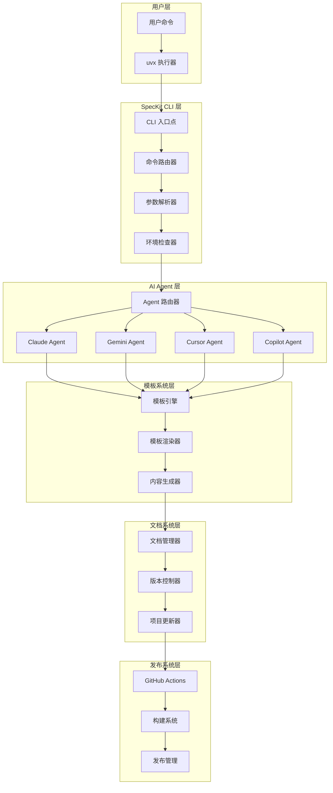
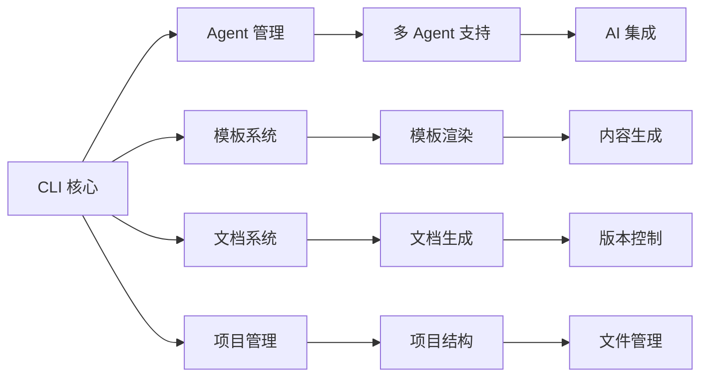

# SpecKit 工程化原理

## 概述

本文档深入解析 SpecKit CLI 的工程化实现原理，包括如何支持多 AI Agent、发布机制、安装机制以及扩展性设计。这些技术实现细节对于理解 SpecKit 的工作原理和进行二次开发具有重要意义。

## 整体架构设计

### 系统架构图



### 核心组件关系



## 多 AI Agent 支持机制

### 1. Agent 抽象层设计

#### Agent 接口定义

```python
# Agent 抽象基类
from abc import ABC, abstractmethod
from typing import Dict, Any, Optional

class BaseAgent(ABC):
    """AI Agent 抽象基类"""
    
    def __init__(self, config: Dict[str, Any]):
        self.config = config
        self.name = self.__class__.__name__
    
    @abstractmethod
    def execute_command(self, command: str, context: Dict[str, Any]) -> str:
        """执行命令并返回结果"""
        pass
    
    @abstractmethod
    def check_availability(self) -> bool:
        """检查 Agent 是否可用"""
        pass
    
    @abstractmethod
    def get_capabilities(self) -> List[str]:
        """获取 Agent 能力列表"""
        pass
```

#### 具体 Agent 实现

```python
# Claude Agent 实现
class ClaudeAgent(BaseAgent):
    def __init__(self, config: Dict[str, Any]):
        super().__init__(config)
        self.api_key = config.get('api_key')
        self.model = config.get('model', 'claude-3-sonnet')
    
    def execute_command(self, command: str, context: Dict[str, Any]) -> str:
        """执行 Claude 命令"""
        try:
            # 准备请求数据
            request_data = self._prepare_request(command, context)
            
            # 调用 Claude API
            response = self._call_claude_api(request_data)
            
            # 处理响应
            return self._process_response(response)
            
        except Exception as e:
            return self._handle_error(e)
    
    def check_availability(self) -> bool:
        """检查 Claude API 是否可用"""
        try:
            # 测试 API 连接
            test_response = self._call_claude_api({
                'prompt': 'test',
                'max_tokens': 1
            })
            return test_response is not None
        except:
            return False
    
    def get_capabilities(self) -> List[str]:
        """获取 Claude 能力列表"""
        return [
            'code_generation',
            'specification_analysis',
            'technical_planning',
            'code_review'
        ]
```

### 2. Agent 路由器

#### 路由策略

```python
class AgentRouter:
    """AI Agent 路由器"""
    
    def __init__(self):
        self.agents = {}
        self.routing_strategies = {
            'command_based': self._route_by_command,
            'project_type': self._route_by_project_type,
            'user_preference': self._route_by_preference,
            'performance': self._route_by_performance
        }
    
    def register_agent(self, agent: BaseAgent):
        """注册 Agent"""
        self.agents[agent.name] = agent
    
    def route_command(self, command: str, context: Dict[str, Any]) -> BaseAgent:
        """路由命令到合适的 Agent"""
        # 获取路由策略
        strategy = context.get('routing_strategy', 'command_based')
        
        # 执行路由
        if strategy in self.routing_strategies:
            return self.routing_strategies[strategy](command, context)
        else:
            return self._default_route(command, context)
    
    def _route_by_command(self, command: str, context: Dict[str, Any]) -> BaseAgent:
        """基于命令类型路由"""
        command_type = self._classify_command(command)
        
        # 根据命令类型选择最适合的 Agent
        if command_type == 'code_generation':
            return self.agents.get('claude') or self._get_available_agent()
        elif command_type == 'specification':
            return self.agents.get('gemini') or self._get_available_agent()
        else:
            return self._get_available_agent()
    
    def _route_by_project_type(self, command: str, context: Dict[str, Any]) -> BaseAgent:
        """基于项目类型路由"""
        project_type = context.get('project_type', 'general')
        
        # 根据项目类型选择 Agent
        if project_type == 'web_app':
            return self.agents.get('cursor') or self._get_available_agent()
        elif project_type == 'mobile_app':
            return self.agents.get('claude') or self._get_available_agent()
        else:
            return self._get_available_agent()
```

### 3. Agent 配置管理

#### 配置文件结构

```yaml
# agent-config.yaml
agents:
  claude:
    enabled: true
    api_key: ${CLAUDE_API_KEY}
    model: claude-3-sonnet
    capabilities:
      - code_generation
      - specification_analysis
      - technical_planning
  
  gemini:
    enabled: true
    api_key: ${GEMINI_API_KEY}
    model: gemini-pro
    capabilities:
      - multi_modal_understanding
      - cross_platform_development
  
  cursor:
    enabled: true
    executable: cursor-agent
    capabilities:
      - modern_development
      - full_stack_development
  
  copilot:
    enabled: true
    vscode_extension: true
    capabilities:
      - ide_integration
      - real_time_assistance

routing:
  default_strategy: command_based
  fallback_agent: claude
  performance_threshold: 0.8
```

#### 配置加载机制

```python
class AgentConfigManager:
    """Agent 配置管理器"""
    
    def __init__(self, config_path: str):
        self.config_path = config_path
        self.config = self._load_config()
    
    def _load_config(self) -> Dict[str, Any]:
        """加载配置文件"""
        try:
            with open(self.config_path, 'r') as f:
                config = yaml.safe_load(f)
            return config
        except Exception as e:
            return self._get_default_config()
    
    def get_agent_config(self, agent_name: str) -> Dict[str, Any]:
        """获取 Agent 配置"""
        return self.config.get('agents', {}).get(agent_name, {})
    
    def is_agent_enabled(self, agent_name: str) -> bool:
        """检查 Agent 是否启用"""
        agent_config = self.get_agent_config(agent_name)
        return agent_config.get('enabled', False)
    
    def get_routing_config(self) -> Dict[str, Any]:
        """获取路由配置"""
        return self.config.get('routing', {})
```

## 发布机制

### 1. GitHub Actions 工作流

#### 主工作流文件

```yaml
# .github/workflows/release.yml
name: Release

on:
  push:
    tags:
      - 'v*'
  workflow_dispatch:

jobs:
  release:
    runs-on: ubuntu-latest
    
    steps:
    - name: Checkout
      uses: actions/checkout@v4
      
    - name: Set up Python
      uses: actions/setup-python@v4
      with:
        python-version: '3.11'
        
    - name: Install uv
      uses: astral-sh/setup-uv@v2
      
    - name: Install dependencies
      run: uv sync
      
    - name: Run tests
      run: uv run pytest
      
    - name: Build package
      run: uv build
      
    - name: Create release
      uses: actions/create-release@v1
      env:
        GITHUB_TOKEN: ${{ secrets.GITHUB_TOKEN }}
      with:
        tag_name: ${{ github.ref }}
        release_name: Release ${{ github.ref }}
        draft: false
        prerelease: false
```

#### 多平台构建

```yaml
# .github/workflows/build-packages.yml
name: Build Packages

on:
  push:
    tags:
      - 'v*'

jobs:
  build:
    strategy:
      matrix:
        os: [ubuntu-latest, windows-latest, macos-latest]
        python-version: ['3.11', '3.12']
    
    runs-on: ${{ matrix.os }}
    
    steps:
    - name: Checkout
      uses: actions/checkout@v4
      
    - name: Set up Python
      uses: actions/setup-python@v4
      with:
        python-version: ${{ matrix.python-version }}
        
    - name: Install uv
      uses: astral-sh/setup-uv@v2
      
    - name: Build wheel
      run: uv build
      
    - name: Upload artifacts
      uses: actions/upload-artifact@v3
      with:
        name: wheel-${{ matrix.os }}-py${{ matrix.python-version }}
        path: dist/*.whl
```

### 2. 包构建系统

#### pyproject.toml 配置

```toml
[build-system]
requires = ["hatchling"]
build-backend = "hatchling.build"

[project]
name = "specify-cli"
version = "0.0.4"
description = "Specification-Driven Development CLI"
authors = [
    {name = "SpecKit Team", email = "team@speckit.dev"}
]
readme = "README.md"
license = {text = "MIT"}
requires-python = ">=3.11"
classifiers = [
    "Development Status :: 4 - Beta",
    "Intended Audience :: Developers",
    "License :: OSI Approved :: MIT License",
    "Programming Language :: Python :: 3",
    "Programming Language :: Python :: 3.11",
    "Programming Language :: Python :: 3.12",
]
dependencies = [
    "typer>=0.9.0",
    "rich>=13.0.0",
    "httpx>=0.24.0",
    "pyyaml>=6.0",
    "jinja2>=3.1.0",
]

[project.optional-dependencies]
dev = [
    "pytest>=7.0.0",
    "pytest-cov>=4.0.0",
    "black>=23.0.0",
    "isort>=5.12.0",
    "mypy>=1.0.0",
]

[project.scripts]
specify = "specify_cli:main"

[project.urls]
Homepage = "https://github.com/github/spec-kit"
Repository = "https://github.com/github/spec-kit"
Documentation = "https://github.com/github/spec-kit#readme"
Issues = "https://github.com/github/spec-kit/issues"

[tool.hatch.build.targets.wheel]
packages = ["src/specify_cli"]
```

#### 构建脚本

```python
# scripts/build.py
import subprocess
import sys
from pathlib import Path

def build_package():
    """构建包"""
    try:
        # 清理之前的构建
        subprocess.run([sys.executable, "-m", "build", "--clean"], check=True)
        
        # 构建包
        subprocess.run([sys.executable, "-m", "build"], check=True)
        
        print("✅ 包构建成功")
        
    except subprocess.CalledProcessError as e:
        print(f"❌ 构建失败: {e}")
        sys.exit(1)

if __name__ == "__main__":
    build_package()
```

### 3. 发布管理

#### 版本管理

```python
# scripts/version.py
import re
from pathlib import Path

class VersionManager:
    def __init__(self, project_root: Path):
        self.project_root = project_root
        self.pyproject_path = project_root / "pyproject.toml"
    
    def get_current_version(self) -> str:
        """获取当前版本"""
        content = self.pyproject_path.read_text()
        match = re.search(r'version = "([^"]+)"', content)
        if match:
            return match.group(1)
        raise ValueError("无法找到版本号")
    
    def bump_version(self, bump_type: str) -> str:
        """升级版本"""
        current_version = self.get_current_version()
        major, minor, patch = map(int, current_version.split('.'))
        
        if bump_type == "major":
            new_version = f"{major + 1}.0.0"
        elif bump_type == "minor":
            new_version = f"{major}.{minor + 1}.0"
        elif bump_type == "patch":
            new_version = f"{major}.{minor}.{patch + 1}"
        else:
            raise ValueError(f"不支持的版本升级类型: {bump_type}")
        
        # 更新 pyproject.toml
        content = self.pyproject_path.read_text()
        new_content = re.sub(
            r'version = "[^"]+"',
            f'version = "{new_version}"',
            content
        )
        self.pyproject_path.write_text(new_content)
        
        return new_version
    
    def create_release_notes(self, version: str) -> str:
        """创建发布说明"""
        # 获取变更日志
        changelog_path = self.project_root / "CHANGELOG.md"
        if changelog_path.exists():
            content = changelog_path.read_text()
            # 提取版本相关的变更
            pattern = rf"## {re.escape(version)}\s*\n(.*?)(?=\n## |$)"
            match = re.search(pattern, content, re.DOTALL)
            if match:
                return match.group(1).strip()
        
        return f"Release {version}"
```

## 安装机制

### 1. uvx 命令实现

#### uvx 工作原理

```python
# uvx 命令解析
def parse_uvx_command(command: str) -> Dict[str, str]:
    """解析 uvx 命令"""
    # 命令格式: uvx --from <source> <package> <command> [args]
    parts = command.split()
    
    if len(parts) < 4:
        raise ValueError("无效的 uvx 命令格式")
    
    return {
        'source': parts[2],  # --from 后的源
        'package': parts[3], # 包名
        'command': parts[4] if len(parts) > 4 else None, # 命令
        'args': parts[5:] if len(parts) > 5 else [] # 参数
    }
```

#### 包下载和安装

```python
# 包下载机制
class PackageDownloader:
    def __init__(self):
        self.cache_dir = Path.home() / ".cache" / "uvx"
        self.cache_dir.mkdir(parents=True, exist_ok=True)
    
    def download_package(self, source: str) -> Path:
        """下载包到缓存"""
        # 生成缓存键
        cache_key = hashlib.md5(source.encode()).hexdigest()
        cache_path = self.cache_dir / cache_key
        
        # 检查缓存
        if cache_path.exists():
            return cache_path
        
        # 下载包
        if source.startswith("git+"):
            return self._download_from_git(source, cache_path)
        elif source.startswith("https://"):
            return self._download_from_url(source, cache_path)
        else:
            raise ValueError(f"不支持的源格式: {source}")
    
    def _download_from_git(self, source: str, cache_path: Path) -> Path:
        """从 Git 仓库下载"""
        # 解析 Git URL
        git_url = source[4:]  # 移除 "git+" 前缀
        
        # 克隆仓库
        subprocess.run([
            "git", "clone", "--depth", "1", git_url, str(cache_path)
        ], check=True)
        
        return cache_path
```

### 2. 项目初始化流程

#### 初始化脚本

```python
# 项目初始化流程
class ProjectInitializer:
    def __init__(self, project_name: str, ai_agent: str):
        self.project_name = project_name
        self.ai_agent = ai_agent
        self.project_path = Path(project_name)
    
    def initialize_project(self):
        """初始化项目"""
        try:
            # 1. 创建项目目录
            self._create_project_structure()
            
            # 2. 生成配置文件
            self._generate_config_files()
            
            # 3. 设置 AI Agent
            self._setup_ai_agent()
            
            # 4. 生成初始文档
            self._generate_initial_docs()
            
            # 5. 初始化 Git 仓库
            self._initialize_git_repo()
            
            print(f"✅ 项目 {self.project_name} 初始化成功")
            
        except Exception as e:
            print(f"❌ 项目初始化失败: {e}")
            raise
    
    def _create_project_structure(self):
        """创建项目结构"""
        directories = [
            "memory",
            "scripts/bash",
            "scripts/powershell",
            "templates/commands",
            "update-notes",
            f".{self.ai_agent}/commands"
        ]
        
        for directory in directories:
            (self.project_path / directory).mkdir(parents=True, exist_ok=True)
    
    def _generate_config_files(self):
        """生成配置文件"""
        # 生成 README.md
        readme_content = self._generate_readme()
        (self.project_path / "README.md").write_text(readme_content)
        
        # 生成项目宪法
        constitution_content = self._generate_constitution()
        (self.project_path / "memory" / "constitution.md").write_text(constitution_content)
    
    def _setup_ai_agent(self):
        """设置 AI Agent"""
        agent_config = {
            'claude': self._setup_claude,
            'gemini': self._setup_gemini,
            'cursor': self._setup_cursor,
            'copilot': self._setup_copilot
        }
        
        if self.ai_agent in agent_config:
            agent_config[self.ai_agent]()
        else:
            raise ValueError(f"不支持的 AI Agent: {self.ai_agent}")
    
    def _setup_claude(self):
        """设置 Claude Agent"""
        claude_dir = self.project_path / ".claude" / "commands"
        claude_dir.mkdir(parents=True, exist_ok=True)
        
        # 生成 Claude 命令模板
        for command in ['plan', 'specify', 'clarify', 'tasks', 'implement', 'analyze']:
            template_content = self._generate_command_template(command, 'claude')
            (claude_dir / f"{command}.md").write_text(template_content)
```

### 3. 跨平台支持

#### 平台检测

```python
# 平台检测和脚本生成
class PlatformManager:
    def __init__(self):
        self.platform = platform.system().lower()
        self.script_extensions = {
            'windows': '.ps1',
            'linux': '.sh',
            'darwin': '.sh'
        }
    
    def get_script_extension(self) -> str:
        """获取脚本扩展名"""
        return self.script_extensions.get(self.platform, '.sh')
    
    def generate_scripts(self, project_path: Path):
        """生成平台特定的脚本"""
        if self.platform == 'windows':
            self._generate_powershell_scripts(project_path)
        else:
            self._generate_bash_scripts(project_path)
    
    def _generate_powershell_scripts(self, project_path: Path):
        """生成 PowerShell 脚本"""
        scripts_dir = project_path / "scripts" / "powershell"
        scripts_dir.mkdir(parents=True, exist_ok=True)
        
        # 生成 PowerShell 脚本
        for script_name in ['check-prerequisites', 'setup-plan', 'create-new-feature']:
            script_content = self._generate_powershell_script(script_name)
            (scripts_dir / f"{script_name}.ps1").write_text(script_content)
    
    def _generate_bash_scripts(self, project_path: Path):
        """生成 Bash 脚本"""
        scripts_dir = project_path / "scripts" / "bash"
        scripts_dir.mkdir(parents=True, exist_ok=True)
        
        # 生成 Bash 脚本
        for script_name in ['check-prerequisites', 'setup-plan', 'create-new-feature']:
            script_content = self._generate_bash_script(script_name)
            (scripts_dir / f"{script_name}.sh").write_text(script_content)
```

## 扩展性设计

### 1. 新 AI Agent 集成

#### Agent 注册机制

```python
# Agent 注册系统
class AgentRegistry:
    def __init__(self):
        self.agents = {}
        self.agent_factories = {}
    
    def register_agent_factory(self, agent_name: str, factory_func):
        """注册 Agent 工厂函数"""
        self.agent_factories[agent_name] = factory_func
    
    def create_agent(self, agent_name: str, config: Dict[str, Any]) -> BaseAgent:
        """创建 Agent 实例"""
        if agent_name in self.agent_factories:
            return self.agent_factories[agent_name](config)
        else:
            raise ValueError(f"未注册的 Agent: {agent_name}")
    
    def get_available_agents(self) -> List[str]:
        """获取可用的 Agent 列表"""
        return list(self.agent_factories.keys())

# 注册新 Agent 的示例
def register_new_agent():
    """注册新 Agent 的示例"""
    def create_custom_agent(config: Dict[str, Any]) -> BaseAgent:
        return CustomAgent(config)
    
    registry = AgentRegistry()
    registry.register_agent_factory('custom', create_custom_agent)
```

#### Agent 配置模板

```yaml
# 新 Agent 配置模板
agents:
  custom:
    enabled: true
    api_key: ${CUSTOM_API_KEY}
    endpoint: https://api.custom.com/v1
    model: custom-model
    capabilities:
      - custom_feature_1
      - custom_feature_2
    parameters:
      temperature: 0.7
      max_tokens: 4000
      timeout: 30
```

### 2. 模板系统扩展

#### 自定义模板

```python
# 模板系统扩展
class TemplateManager:
    def __init__(self, templates_dir: Path):
        self.templates_dir = templates_dir
        self.template_cache = {}
    
    def register_template(self, name: str, template_path: Path):
        """注册新模板"""
        if template_path.exists():
            self.template_cache[name] = template_path
        else:
            raise FileNotFoundError(f"模板文件不存在: {template_path}")
    
    def render_template(self, name: str, context: Dict[str, Any]) -> str:
        """渲染模板"""
        if name not in self.template_cache:
            raise ValueError(f"未注册的模板: {name}")
        
        template_path = self.template_cache[name]
        template_content = template_path.read_text()
        
        # 使用 Jinja2 渲染模板
        from jinja2 import Template
        template = Template(template_content)
        return template.render(**context)
    
    def create_custom_template(self, name: str, content: str):
        """创建自定义模板"""
        template_path = self.templates_dir / f"{name}.md"
        template_path.write_text(content)
        self.register_template(name, template_path)
```

### 3. 插件系统

#### 插件接口

```python
# 插件系统接口
class PluginInterface(ABC):
    @abstractmethod
    def get_name(self) -> str:
        """获取插件名称"""
        pass
    
    @abstractmethod
    def get_version(self) -> str:
        """获取插件版本"""
        pass
    
    @abstractmethod
    def get_capabilities(self) -> List[str]:
        """获取插件能力"""
        pass
    
    @abstractmethod
    def execute(self, command: str, context: Dict[str, Any]) -> Any:
        """执行插件功能"""
        pass

# 插件管理器
class PluginManager:
    def __init__(self):
        self.plugins = {}
        self.plugin_configs = {}
    
    def load_plugin(self, plugin_path: Path):
        """加载插件"""
        try:
            # 动态导入插件模块
            import importlib.util
            spec = importlib.util.spec_from_file_location("plugin", plugin_path)
            module = importlib.util.module_from_spec(spec)
            spec.loader.exec_module(module)
            
            # 获取插件实例
            plugin_instance = module.Plugin()
            
            # 注册插件
            self.plugins[plugin_instance.get_name()] = plugin_instance
            
        except Exception as e:
            print(f"加载插件失败: {e}")
    
    def execute_plugin(self, plugin_name: str, command: str, context: Dict[str, Any]):
        """执行插件"""
        if plugin_name in self.plugins:
            plugin = self.plugins[plugin_name]
            return plugin.execute(command, context)
        else:
            raise ValueError(f"未找到插件: {plugin_name}")
```

## 性能优化

### 1. 缓存机制

#### 多级缓存系统

```python
# 缓存系统
class CacheManager:
    def __init__(self):
        self.memory_cache = {}
        self.disk_cache = Path.home() / ".cache" / "speckit"
        self.disk_cache.mkdir(parents=True, exist_ok=True)
    
    def get(self, key: str) -> Optional[Any]:
        """获取缓存"""
        # 1. 内存缓存
        if key in self.memory_cache:
            return self.memory_cache[key]
        
        # 2. 磁盘缓存
        cache_file = self.disk_cache / f"{key}.json"
        if cache_file.exists():
            try:
                import json
                with open(cache_file, 'r') as f:
                    data = json.load(f)
                self.memory_cache[key] = data
                return data
            except:
                pass
        
        return None
    
    def set(self, key: str, value: Any, ttl: int = 3600):
        """设置缓存"""
        # 内存缓存
        self.memory_cache[key] = value
        
        # 磁盘缓存
        cache_file = self.disk_cache / f"{key}.json"
        try:
            import json
            with open(cache_file, 'w') as f:
                json.dump(value, f)
        except:
            pass
    
    def clear(self, pattern: str = None):
        """清理缓存"""
        if pattern:
            # 清理匹配的缓存
            for key in list(self.memory_cache.keys()):
                if pattern in key:
                    del self.memory_cache[key]
        else:
            # 清理所有缓存
            self.memory_cache.clear()
            for cache_file in self.disk_cache.glob("*.json"):
                cache_file.unlink()
```

### 2. 异步处理

#### 异步命令执行

```python
# 异步处理系统
import asyncio
from concurrent.futures import ThreadPoolExecutor

class AsyncCommandExecutor:
    def __init__(self):
        self.executor = ThreadPoolExecutor(max_workers=4)
        self.semaphore = asyncio.Semaphore(10)  # 限制并发数
    
    async def execute_command(self, command: str, context: Dict[str, Any]) -> str:
        """异步执行命令"""
        async with self.semaphore:
            # 在线程池中执行阻塞操作
            loop = asyncio.get_event_loop()
            result = await loop.run_in_executor(
                self.executor,
                self._execute_sync,
                command,
                context
            )
            return result
    
    def _execute_sync(self, command: str, context: Dict[str, Any]) -> str:
        """同步执行命令"""
        # 实际的命令执行逻辑
        pass
    
    async def execute_multiple_commands(self, commands: List[Tuple[str, Dict[str, Any]]]) -> List[str]:
        """并发执行多个命令"""
        tasks = [
            self.execute_command(command, context)
            for command, context in commands
        ]
        return await asyncio.gather(*tasks)
```

### 3. 资源管理

#### 连接池管理

```python
# 连接池管理
class ConnectionPool:
    def __init__(self, max_connections: int = 10):
        self.max_connections = max_connections
        self.connections = []
        self.available_connections = []
        self.lock = asyncio.Lock()
    
    async def get_connection(self):
        """获取连接"""
        async with self.lock:
            if self.available_connections:
                return self.available_connections.pop()
            elif len(self.connections) < self.max_connections:
                connection = await self._create_connection()
                self.connections.append(connection)
                return connection
            else:
                # 等待可用连接
                while not self.available_connections:
                    await asyncio.sleep(0.1)
                return self.available_connections.pop()
    
    async def release_connection(self, connection):
        """释放连接"""
        async with self.lock:
            self.available_connections.append(connection)
    
    async def _create_connection(self):
        """创建新连接"""
        # 创建连接的逻辑
        pass
```

## 总结

SpecKit 的工程化实现体现了现代软件开发的最佳实践：

1. **模块化设计**: 清晰的组件分离和接口定义
2. **可扩展架构**: 支持新 AI Agent 和插件的集成
3. **跨平台支持**: 统一的接口，平台特定的实现
4. **性能优化**: 多级缓存、异步处理、资源管理
5. **质量保证**: 自动化测试、持续集成、版本管理

这种设计确保了 SpecKit 的可靠性、可维护性和可扩展性，为规范驱动开发提供了强大的技术基础。

---

**相关文档**:
- [SpecKit 命令原理](./speckit-commands-principles.md) - 深入了解命令工作机制
- [uvx 命令实现原理详解](./uvx-implementation-guide.md) - 安装机制详解
- [实际项目开发流程指南](./practical-workflow-guide.md) - 实战应用
