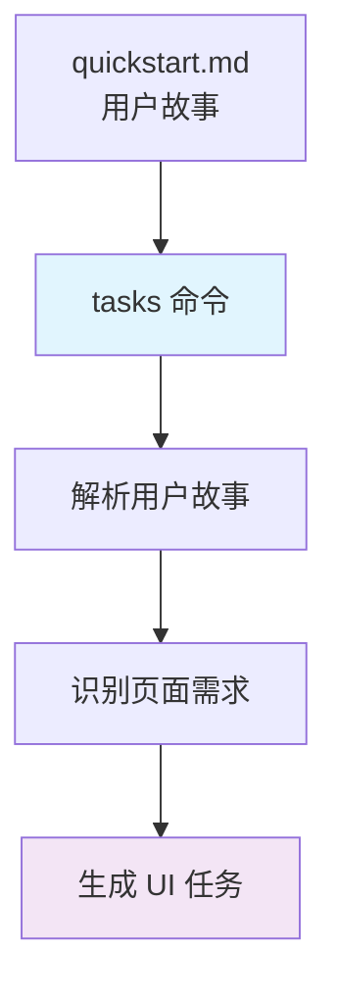
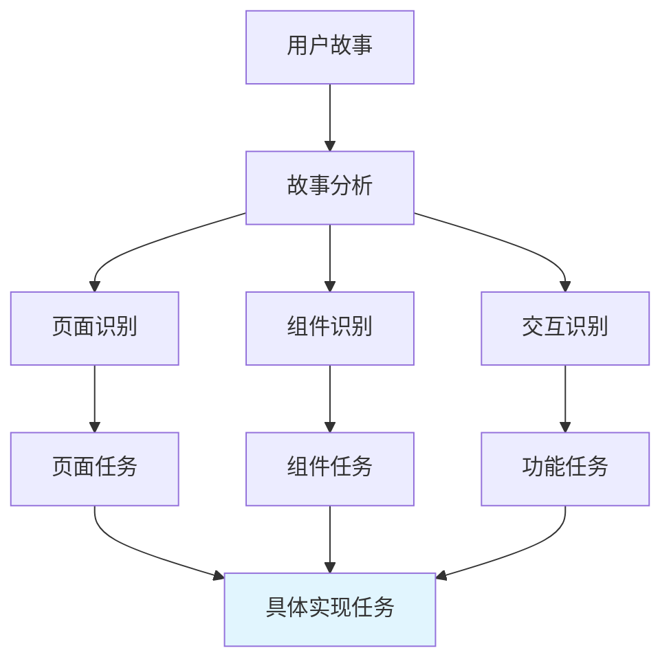
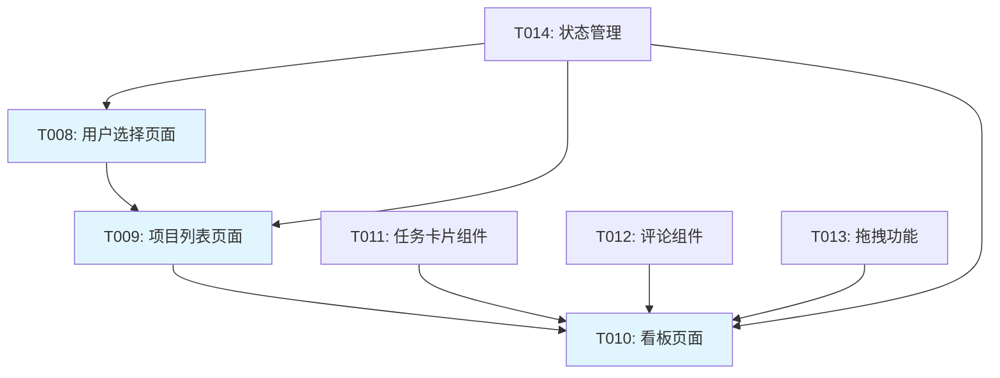
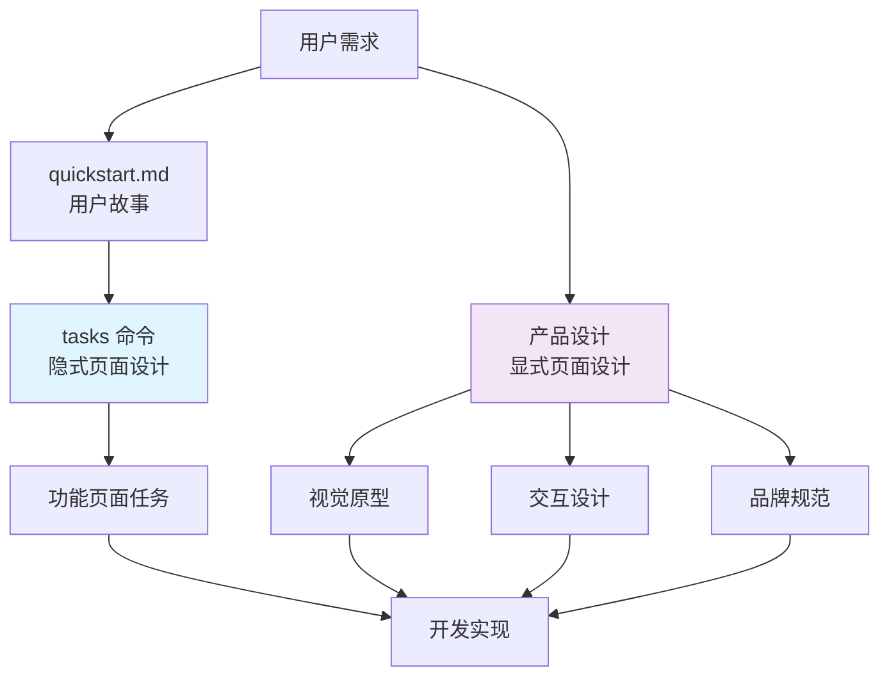
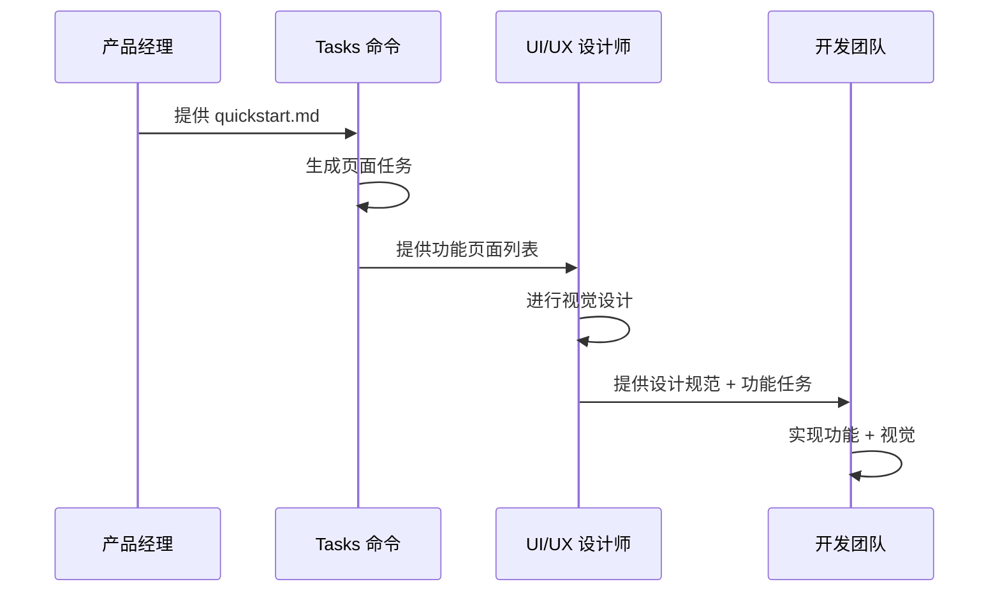
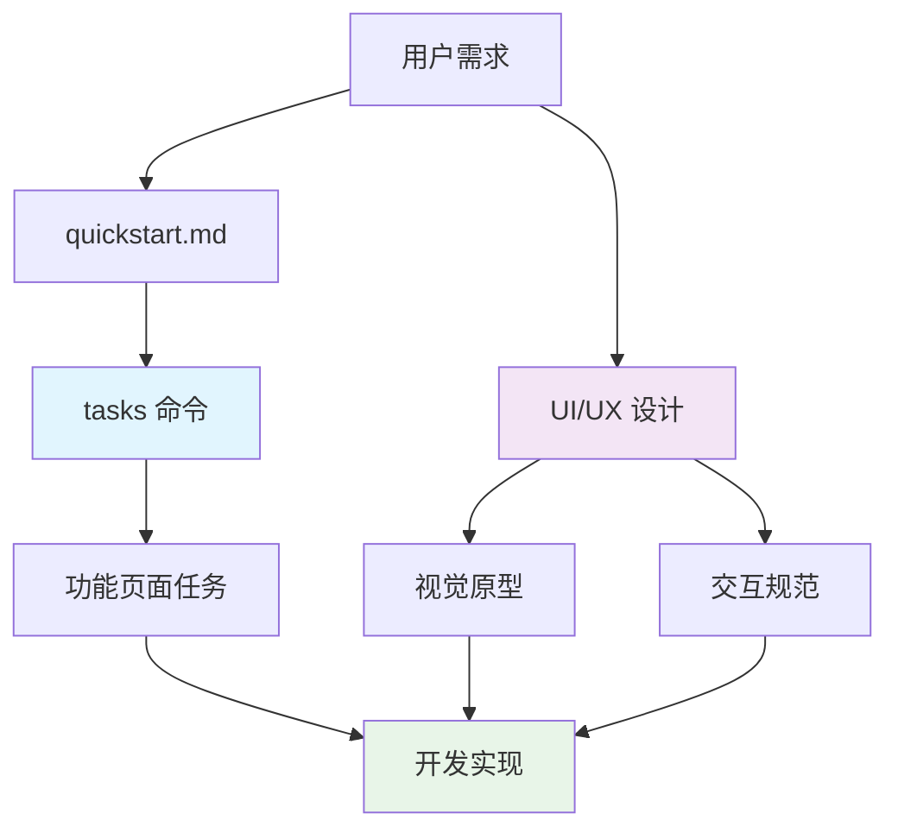

# Tasks 隐式页面设计指南

## 概述

本指南深入解析 spec-kit 中 tasks 命令的隐式页面设计机制。通过分析 tasks 命令如何基于用户故事自动生成页面级别的开发任务，帮助开发者理解 spec-driven 开发中页面拆解的自动化过程。

## 目录

- [Tasks 隐式页面设计的概念](#tasks-隐式页面设计的概念)
- [隐式页面设计的机制](#隐式页面设计的机制)
- [任务生成规则分析](#任务生成规则分析)
- [页面拆解的具体实现](#页面拆解的具体实现)
- [与显式页面设计的关系](#与显式页面设计的关系)
- [实际应用示例](#实际应用示例)
- [优势与局限性](#优势与局限性)
- [最佳实践建议](#最佳实践建议)
- [常见问题解答](#常见问题解答)

## Tasks 隐式页面设计的概念

### 什么是隐式页面设计

**隐式页面设计**是指在 tasks 命令执行过程中，基于用户故事自动生成页面级别开发任务的过程。这个过程不需要手动进行页面拆解，而是通过分析 quickstart.md 中的用户故事，自动推导出需要实现的页面和组件。

### 与显式页面设计的区别

| 方面 | 隐式页面设计 | 显式页面设计 |
|------|-------------|-------------|
| **触发时机** | tasks 命令执行时自动生成 | 设计师手动创建 |
| **输入来源** | quickstart.md 中的用户故事 | 产品需求和设计规范 |
| **输出内容** | 功能性的页面和组件任务 | 视觉化的界面设计 |
| **关注重点** | 用户交互逻辑和功能实现 | 视觉表现和用户体验 |
| **技术细节** | 不涉及具体的技术实现 | 包含布局、颜色、字体等 |

## 隐式页面设计的机制

### 1. 输入分析阶段



**输入来源**：
- `quickstart.md` 中的用户故事
- `data-model.md` 中的数据实体
- `contracts/` 中的 API 端点
- `plan.md` 中的技术栈信息

### 2. 故事解析过程

tasks 命令会分析用户故事中的关键信息：

```text
# 用户故事示例
"When you first launch Taskify, it's going to give you a list of the five users to pick from"
"When you click on a user, you go into the main view, which displays the list of projects"
"When you click on a project, you open the Kanban board for that project"
```

**解析结果**：
- 识别页面：用户选择页面、项目列表页面、看板页面
- 识别组件：用户选择器、项目卡片、任务卡片
- 识别交互：点击、拖拽、状态更新

### 3. 任务生成规则

基于 `templates/commands/tasks.md` 中的规则：

```markdown
4. Task generation rules:
   - Each contract file → contract test task marked [P]
   - Each entity in data-model → model creation task marked [P]
   - Each endpoint → implementation task (not parallel if shared files)
   - Each user story → integration test marked [P]  # ← 关键规则
   - Different files = can be parallel [P]
   - Same file = sequential (no [P])
```

## 任务生成规则分析

### 1. 路径约定规则

从 `templates/tasks-template.md` 第39-43行：

```markdown
## Path Conventions
- **Single project**: `src/`, `tests/` at repository root
- **Web app**: `backend/src/`, `frontend/src/`  # ← 支持前端项目
- **Mobile**: `api/src/`, `ios/src/` or `android/src/`
```

**关键点**：
- 自动识别项目类型（单项目/Web应用/移动应用）
- 根据项目类型生成对应的目录结构
- 为前端项目生成 `frontend/src/` 路径

### 2. 任务分类规则

```markdown
3. Generate tasks following the template:
   - **Setup tasks**: Project init, dependencies, linting
   - **Test tasks [P]**: One per contract, one per integration scenario
   - **Core tasks**: One per entity, service, CLI command, endpoint
   - **Integration tasks**: DB connections, middleware, logging
   - **Polish tasks [P]**: Unit tests, performance, docs
```

**UI 相关任务归类**：
- **Core tasks**：页面组件、UI 服务
- **Integration tasks**：前端与后端的集成
- **Test tasks**：UI 组件的测试

### 3. 依赖排序规则

从 `plan-template.md` 第199行：

```markdown
**Ordering Strategy**:
- TDD order: Tests before implementation 
- Dependency order: Models before services before UI  # ← UI 任务排序
- Mark [P] for parallel execution (independent files)
```

**排序逻辑**：
1. **Setup** → 项目初始化
2. **Tests** → 测试用例编写
3. **Models** → 数据模型
4. **Services** → 业务服务
5. **UI** → 页面和组件实现
6. **Integration** → 系统集成
7. **Polish** → 优化和文档

## 页面拆解的具体实现

### 1. 基于用户故事的任务生成



### 2. 实际任务生成示例

基于 Taskify 项目的用户故事：

```markdown
# 生成的页面任务示例
## Phase 3.3: Core Implementation
- [ ] T008 [P] User selection page in frontend/src/pages/UserSelectionPage.vue
- [ ] T009 [P] Project list page in frontend/src/pages/ProjectListPage.vue
- [ ] T010 [P] Kanban board page in frontend/src/pages/KanbanBoardPage.vue
- [ ] T011 [P] Task card component in frontend/src/components/TaskCard.vue
- [ ] T012 [P] Comment section component in frontend/src/components/CommentSection.vue
- [ ] T013 [P] Drag and drop functionality in frontend/src/utils/dragDrop.js
- [ ] T014 [P] User authentication state management in frontend/src/stores/auth.js
```

### 3. 任务依赖关系



## 与显式页面设计的关系

### 1. 互补关系



### 2. 协作模式

**理想协作流程**：
1. **产品经理**：提供用户故事和功能需求
2. **tasks 命令**：基于用户故事生成功能页面任务
3. **UI/UX 设计师**：基于功能页面任务进行视觉设计
4. **开发团队**：结合功能任务和视觉设计进行实现

### 3. 信息传递



## 实际应用示例

### 1. 电商网站示例

**用户故事**：
```text
"As a customer, I want to browse products by category so that I can find what I'm looking for"
"As a customer, I want to add items to my cart so that I can purchase them later"
"As a customer, I want to checkout securely so that I can complete my purchase"
```

**生成的页面任务**：
```markdown
- [ ] T008 [P] Product category page in frontend/src/pages/CategoryPage.vue
- [ ] T009 [P] Product listing component in frontend/src/components/ProductList.vue
- [ ] T010 [P] Product card component in frontend/src/components/ProductCard.vue
- [ ] T011 [P] Shopping cart page in frontend/src/pages/CartPage.vue
- [ ] T012 [P] Cart item component in frontend/src/components/CartItem.vue
- [ ] T013 [P] Checkout page in frontend/src/pages/CheckoutPage.vue
- [ ] T014 [P] Payment form component in frontend/src/components/PaymentForm.vue
```

### 2. 博客系统示例

**用户故事**：
```text
"As a reader, I want to see a list of blog posts so that I can choose what to read"
"As a reader, I want to read individual blog posts so that I can get the information I need"
"As a reader, I want to search for posts so that I can find specific topics"
```

**生成的页面任务**：
```markdown
- [ ] T008 [P] Blog home page in frontend/src/pages/BlogHomePage.vue
- [ ] T009 [P] Post list component in frontend/src/components/PostList.vue
- [ ] T010 [P] Post card component in frontend/src/components/PostCard.vue
- [ ] T011 [P] Post detail page in frontend/src/pages/PostDetailPage.vue
- [ ] T012 [P] Search functionality in frontend/src/components/SearchBar.vue
- [ ] T013 [P] Search results page in frontend/src/pages/SearchResultsPage.vue
```

## 优势与局限性

### 优势

#### 1. 自动化程度高
- ✅ **无需手动拆解**：基于用户故事自动生成页面任务
- ✅ **减少重复工作**：避免每次都要手动分析页面结构
- ✅ **提高效率**：快速生成可执行的开发任务

#### 2. 功能导向
- ✅ **用户需求驱动**：确保页面实现符合用户期望
- ✅ **测试驱动**：每个页面任务都有对应的测试场景
- ✅ **业务逻辑清晰**：基于用户故事的业务流程生成任务

#### 3. 开发效率
- ✅ **任务粒度合适**：每个任务都是可独立完成的功能单元
- ✅ **依赖关系明确**：自动处理任务之间的依赖关系
- ✅ **并行执行支持**：标记可并行执行的任务

### 局限性

#### 1. 缺乏视觉设计
- ❌ **无布局信息**：不知道元素在页面上的具体位置
- ❌ **无颜色方案**：没有定义页面的色彩搭配
- ❌ **无字体规范**：没有指定字体类型和大小
- ❌ **无图标设计**：没有定义图标和视觉元素

#### 2. 缺乏交互细节
- ❌ **无动画效果**：没有定义页面过渡和交互动画
- ❌ **无状态反馈**：没有定义加载、错误等状态的表现
- ❌ **无响应式设计**：没有考虑不同屏幕尺寸的适配

#### 3. 缺乏品牌表达
- ❌ **无品牌风格**：没有体现产品的视觉风格
- ❌ **无情感设计**：没有考虑用户的情感体验
- ❌ **无差异化**：生成的页面可能缺乏独特性

## 最佳实践建议

### 1. 结合显式设计

**推荐工作流程**：


### 2. 任务细化策略

**对于复杂页面**：
- 将大页面拆分为多个小组件任务
- 为每个组件定义清晰的职责边界
- 确保组件之间的接口设计合理

**示例**：
```markdown
# 复杂页面的任务拆分
- [ ] T008 [P] User dashboard layout in frontend/src/layouts/DashboardLayout.vue
- [ ] T009 [P] Navigation sidebar in frontend/src/components/NavigationSidebar.vue
- [ ] T010 [P] User profile section in frontend/src/components/UserProfile.vue
- [ ] T011 [P] Activity feed component in frontend/src/components/ActivityFeed.vue
- [ ] T012 [P] Quick actions panel in frontend/src/components/QuickActions.vue
```

### 3. 测试策略

**为每个页面任务编写测试**：
```markdown
# 测试任务示例
- [ ] T008 [P] User selection page in frontend/src/pages/UserSelectionPage.vue
- [ ] T009 [P] Test user selection page in frontend/src/tests/pages/UserSelectionPage.test.js
- [ ] T010 [P] Test user selection component in frontend/src/tests/components/UserSelection.test.js
```

### 4. 文档化策略

**为生成的页面任务添加文档**：
```markdown
# 任务文档示例
## T008: User Selection Page
**Purpose**: Allow users to select their identity when launching the application
**Dependencies**: T001-T007 (Setup and tests)
**Acceptance Criteria**:
- Display 5 user selection buttons
- Handle user click events
- Navigate to main view after selection
**Files**: frontend/src/pages/UserSelectionPage.vue
```

## 常见问题解答

### Q1: 隐式页面设计能完全替代显式设计吗？

**A**: 不能。隐式页面设计专注于功能实现，而显式设计专注于用户体验。两者应该结合使用：
- **隐式设计**：确保功能完整性
- **显式设计**：确保用户体验质量

### Q2: 如何确保生成的页面任务质量？

**A**: 通过以下方式确保质量：
- **详细的用户故事**：在 quickstart.md 中提供清晰的用户故事
- **测试驱动**：为每个页面任务编写对应的测试
- **代码审查**：在实现过程中进行代码审查
- **用户反馈**：通过用户测试验证页面功能

### Q3: 生成的页面任务可以修改吗？

**A**: 可以。tasks 命令生成的是建议性的任务列表，开发团队可以根据实际情况进行调整：
- **添加任务**：补充遗漏的功能
- **删除任务**：移除不必要的功能
- **修改任务**：调整任务的实现方式
- **重新排序**：调整任务的执行顺序

### Q4: 如何处理复杂的页面交互？

**A**: 对于复杂交互，建议：
- **拆分为多个任务**：将复杂交互分解为多个简单任务
- **定义中间状态**：明确交互过程中的中间状态
- **编写详细测试**：为复杂交互编写全面的测试用例
- **原型验证**：在实现前创建交互原型进行验证

### Q5: 隐式页面设计适合所有类型的项目吗？

**A**: 适合大多数项目，但有一些限制：
- **适合**：功能导向的 Web 应用、管理后台、工具类应用
- **不太适合**：高度定制化的品牌网站、游戏界面、艺术类应用
- **需要补充**：所有项目都需要显式设计来完善用户体验

## 总结

Tasks 命令的隐式页面设计是 spec-driven 开发的一个重要特性，它通过自动化页面任务生成，显著提高了开发效率。然而，它不能完全替代显式页面设计，两者应该结合使用：

### 核心价值
- ✅ **自动化页面拆解**：基于用户故事自动生成页面任务
- ✅ **功能导向开发**：确保页面实现符合用户需求
- ✅ **提高开发效率**：减少手动页面拆解的工作量
- ✅ **测试驱动开发**：为每个页面任务提供测试支持

### 使用建议
- 将隐式页面设计作为功能开发的基础
- 结合显式设计完善用户体验
- 根据项目特点调整任务生成策略
- 持续优化和改进页面任务质量

通过正确理解和使用隐式页面设计，可以显著提高 spec-driven 开发的效率和质量，同时为后续的显式设计提供良好的功能基础。

---

*本文档基于 spec-kit 项目分析整理，如有疑问请参考项目源码或相关文档。*


